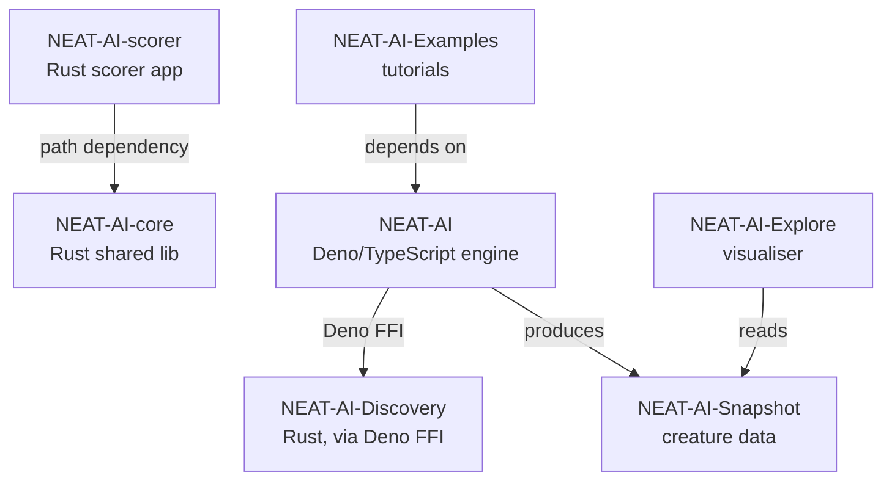
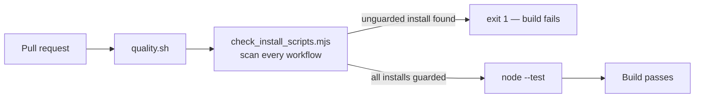

# NEAT-AI-Snapshot

Default creature/genome snapshot data for the NEAT-AI project. The repository serves `snapshot.json.gz` from `docs/` via GitHub Pages so [NEAT-AI-Explore](https://github.com/stSoftwareAU/NEAT-AI-Explore) and other downstream tools can fetch a known-good example without re-running training.

## Related Repositories

The NEAT-AI project is split across seven public repositories. Each focuses on one concern and composes with the others as shown below.

| Repository | Role |
| ---------- | ---- |
| [NEAT-AI](https://github.com/stSoftwareAU/NEAT-AI) | Primary Deno/TypeScript neural-network engine (evolution, training, WASM activation). |
| [NEAT-AI-core](https://github.com/stSoftwareAU/NEAT-AI-core) | Shared native Rust library (`neat-core`) with numerics, topology helpers, and the chunked `.bin` training stream. |
| [NEAT-AI-Discovery](https://github.com/stSoftwareAU/NEAT-AI-Discovery) | Rust discovery module invoked by NEAT-AI via Deno FFI to search architectures and hyper-parameters. |
| [NEAT-AI-Snapshot](https://github.com/stSoftwareAU/NEAT-AI-Snapshot) | Creature/genome snapshot format and fixtures produced by NEAT-AI and consumed by downstream tools. |
| [NEAT-AI-scorer](https://github.com/stSoftwareAU/NEAT-AI-scorer) | Production forward-only scoring application built on `neat-core` via a path dependency. |
| [NEAT-AI-Explore](https://github.com/stSoftwareAU/NEAT-AI-Explore) | Visualiser for creatures that reads NEAT-AI-Snapshot data. |
| [NEAT-AI-Examples](https://github.com/stSoftwareAU/NEAT-AI-Examples) | Worked examples and tutorials that depend on NEAT-AI. |

### Dependency graph

## Quality gate

`./quality.sh` runs the repository's own checks and is what CI runs on every
pull request, so a local run and CI check exactly the same things:

| Stage | Command | What it enforces |
| ----- | ------- | ---------------- |
| Workflow install-script guard | `node tools/check_install_scripts.mjs` | Every package install in `.github/workflows/**` disables install-time lifecycle scripts (`--ignore-scripts`). |
| Unit tests | `node --test "tests/**/*.test.mjs"` | The guard's own behaviour, including the repository's real workflow files. |

The guard exists because `npm install` runs `preinstall`/`install`/
`postinstall` for the installed package **and every transitive dependency** by
default. A compromised publish would therefore execute arbitrary code on the
runner before the tool it installed is ever invoked, so every install in CI
must opt out explicitly.

