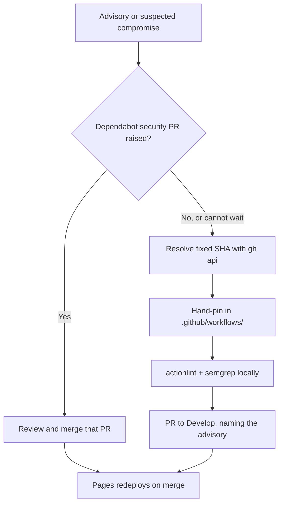

# Security Policy

NEAT-AI-Snapshot is a data-fixture repository: it publishes
`docs/snapshot.json.gz` and a small static viewer through GitHub Pages. It ships
no server, runs no user code, and declares no package manifest, so its only
tracked dependencies are the GitHub Actions pinned in `.github/workflows/`. This
document is the single discoverable place that says who to contact about a
suspected vulnerability and how an emergency dependency bump is fast-tracked.

> **🇦🇺 Note:** This project uses Australian English in documentation (e.g.
> `behaviour`, `organisation`). Tool and Web API names keep their original
> spelling.

---

## 🛡️ Reporting a vulnerability

Report suspected vulnerabilities **privately** — do **not** open a public GitHub
issue for an undisclosed vulnerability.

- Email **<security@stsoftware.com.au>**, or
- Use GitHub's **"Report a vulnerability"** flow under this repository's
  **Security** tab (private vulnerability reporting).

Include, where you can: the affected file, workflow, or action; the version or
commit; the impact; and steps to reproduce. We aim to acknowledge a report
within a few working days.

---

## 📋 Scope

| In scope | Out of scope |
| -------- | ------------ |
| The published snapshot data under `docs/` and the static viewer that renders it | The NEAT-AI engine itself — report against [NEAT-AI](https://github.com/stSoftwareAU/NEAT-AI) |
| The GitHub Actions workflows under `.github/workflows/` and the actions they pin | Downstream consumers — report against [NEAT-AI-Explore](https://github.com/stSoftwareAU/NEAT-AI-Explore) and friends |

This repository has no release line: consumers fetch the snapshot from the
Pages site, so a fix is live once it merges to `Develop` and Pages redeploys.

---

## 🚨 Emergency dependency bump

Routine bumps arrive as Dependabot pull requests
(`.github/dependabot.yml`): one batched `github-actions` pull request a week,
held behind a seven-day `cooldown` so a freshly published — possibly
compromised — release is not taken on its publication day.

Dependabot ignores that cooldown for **security** updates, so an advisory
against a pinned action raises a pull request immediately and no override is
needed. Use the steps below only when a fix must land ahead of that: an
actively-exploited action with no Dependabot pull request yet, or a compromised
release that must be pinned away from *now*.

1. **Identify every affected pin.** Each `uses:` reference is a 40-character
   commit SHA with its tag in a trailing comment:

   ```bash
   grep -rn "uses:" .github/workflows/
   ```

2. **Resolve the known-good commit** for the fixed tag — never write a SHA from
   memory:

   ```bash
   gh api repos/<owner>/<action>/commits/<tag> --jq .sha
   ```

3. **Apply the pin by hand** in each workflow, keeping the trailing `# <tag>`
   comment in step with the SHA. Where no fixed release exists yet, pin back to
   the last known-good SHA instead.
4. **Verify** before opening the pull request:

   ```bash
   actionlint < /dev/null
   semgrep --config p/default .github/ --quiet < /dev/null
   ```

5. **Open a pull request to `Develop`**, naming the advisory (CVE or GHSA ID)
   and the decision to bypass the weekly cadence in the body, so the trade-off
   is auditable. The `semgrep`, `gitleaks`, `dependency-review` and `actionlint`
   checks run on the pull request; once it merges, `pages.yml` redeploys the
   published snapshot.

A hand-applied bump does **not** require touching the Dependabot cooldown: the
cooldown governs only what the *updater* proposes, so it never blocks a pin a
maintainer commits directly. Leave `.github/dependabot.yml` at its default
seven-day window.



---

## 🔗 Related

- `.github/dependabot.yml` — the advisory/alerting channel that routes security
  updates to a human (issue #45, `SCR-SEC-ALERTING`).
- `README.md` — the repository's purpose and its place in the NEAT-AI
  dependency graph.
