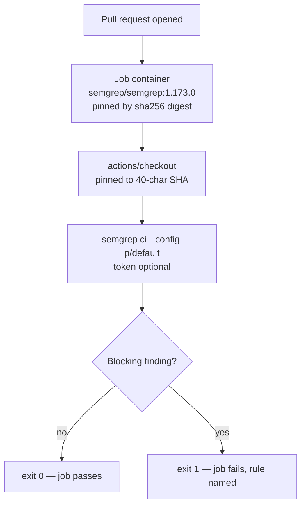

# Add Semgrep SAST Scanning workflow

## Summary

Adds `.github/workflows/semgrep.yml`, which runs Semgrep static analysis over
every pull request and fails the build on a blocking finding. Closes #10.

The workflow follows the template in the issue. Two things were changed after
verifying the template's assumptions against this repository:

- **A job timeout** (`timeout-minutes: 15`) was added, matching the pattern
  already used by `gitleaks.yml`.
- **`pages.yml` was pinned to commit SHAs.** Semgrep's `p/default` ruleset
  contains `yaml.github-actions.security.github-actions-mutable-action-tag`,
  which flags the four `@v3`/`@v4`/`@v5` tags in `pages.yml` as *blocking*.
  Without this fix the new gate would have failed red on day one, on every PR.
  Pinning is also this repository's stated supply-chain policy — `gitleaks.yml`
  already does it.

### `SEMGREP_APP_TOKEN` is optional here

This organisation exposes three Actions secrets to this repository
(`ACTIONS_PUSH`, `CODECOV_TOKEN`, `GITLEAKS_LICENSE`) — there is no
`SEMGREP_APP_TOKEN`. The template's env reference was kept anyway, because it
resolves to an empty string today and picks up the Semgrep AppSec Platform
automatically if the secret is ever added, with no workflow edit.

The token-less path was **verified behaviourally**, not assumed: `semgrep ci
--config p/default` with `SEMGREP_APP_TOKEN=""` completes a full scan against
the open-source registry ruleset (1074 rules) and still exits non-zero on a
finding. Unlike `gitleaks.yml`, no fallback branch is needed — one command
covers both cases.

## Evidence

This is a CI-only change with no web interface, so there is no screenshot to
capture. It was verified by running the workflow's real command — same Semgrep
version, same ruleset — against real git history.



### Supply-chain verification

Both external references were resolved independently rather than trusted from
the issue text:

| Reference | Pin | Verified against |
|---|---|---|
| `semgrep/semgrep:1.173.0` | `sha256:67319956…cb77a` | Docker Hub `docker-content-digest` for tag `1.173.0` |
| `actions/checkout` | `3d3c42e5aac5ba805825da76410c181273ba90b1` | resolves to tag `v7.0.1` |

The `pages.yml` pins were resolved the same way, each to the newest release of
the major version already in use (no version bumps — that is separate work):

| Action | Was | Pin | Tag |
|---|---|---|---|
| `actions/checkout` | `@v4` | `11d5960a326750d5838078e36cf38b85af677262` | v4.4.0 |
| `actions/configure-pages` | `@v5` | `983d7736d9b0ae728b81ab479565c72886d7745b` | v5.0.0 |
| `actions/upload-pages-artifact` | `@v3` | `56afc609e74202658d3ffba0e8f6dda462b719fa` | v3.0.1 |
| `actions/deploy-pages` | `@v4` | `d6db90164ac5ed86f2b6aed7e0febac5b3c0c03e` | v4.0.5 |

All four releases are far older than the 24-hour dependency quarantine window.

### Behavioural runs

Semgrep 1.173.0 — the exact version the workflow pins — was installed locally
and the workflow's command run against real repositories:

| Case | Result |
|---|---|
| This branch, full working tree | exit **0**, 0 findings, 11 targets, 1074 rules |
| `Develop` as it stands today | exit **1**, 4 blocking findings — the `pages.yml` mutable tags this PR fixes |
| Planted `eval()` on a URL parameter in `docs/demo.js` | exit **1**, 2 blocking JS rules fired |
| One `pages.yml` pin reverted to `@v4` | exit **1**, `github-actions-mutable-action-tag` fired |
| Planted `shell=True` + `eval()` in Python | exit **1**, 2 blocking rules fired |
| Clean tree, `SEMGREP_APP_TOKEN=""` | exit **0** — token-less scanning confirmed working |

The `Develop` row is the important one: it proves the gate is not a no-op on
this repository, and that the `pages.yml` change in this PR is what makes it
green.

### Structural assertions

The committed YAML was parsed and asserted on (13/13 passed):

```text
PASS triggers on pull_request only
PASS targets all branches
PASS least-privilege permissions
PASS job has a timeout
PASS runs on ubuntu-latest
PASS scanner image pinned by sha256 digest
PASS at least one action used
PASS all 1 actions pinned to 40-char SHAs
PASS exactly one scan step
PASS scan uses `semgrep ci`
PASS scan pins an explicit ruleset
PASS no `|| true` / `continue-on-error` masking a failure
PASS no untrusted `${{ }}` interpolated into a run: block
```

**`actionlint` exit 0** on both `semgrep.yml` and the modified `pages.yml`.

### Notes for the reviewer

- The scanner image is Alpine-based (`alpine:3.23`). GitHub's runner mounts a
  musl Node build into musl containers, which is what lets `actions/checkout`
  run inside it — this is the configuration Semgrep documents. The workflow
  triggers on `pull_request`, so it gates the PR that introduces it and this is
  confirmed live rather than assumed (see the CI result below).
- `semgrep ci` scans only files tracked by git and skips files over 1 MB, so the
  16 MB `snapshot.json.gz` is not scanned. The dominant PR type here is the
  automated snapshot refresh, which therefore cannot be blocked by this gate.
- This repository has no `quality.sh`; it holds snapshot data and workflow YAML
  only. `actionlint` plus the checks above are the applicable gates.

## Test Plan

The deliverable is a GitHub Actions workflow and this repository has no test
harness (snapshot data and workflow YAML only). Rather than introduce one for a
single YAML file, the workflow was validated by executing its real command
against real git history — every check asserts on an exit code or observable
output, not on source text:

- `actionlint .github/workflows/semgrep.yml .github/workflows/pages.yml` →
  exit 0.
- Parse the committed YAML and assert the 13 structural properties listed above
  (trigger, permissions, timeout, digest pinning, SHA pinning, single scan step,
  explicit ruleset, no failure masking, no expression injection into `run:`).
- Run `semgrep ci --config p/default` over this branch → exit 0.
- Run it over `Develop` → exit 1 on the pre-existing mutable action tags.
- Run it over a clone of this branch with a planted `eval()` sink → exit 1.
- Run it with one `pages.yml` pin reverted to a mutable tag → exit 1.
- Run it token-less (`SEMGREP_APP_TOKEN=""`) on clean and vulnerable trees →
  exit 0 and exit 1 respectively.

Once merged, the workflow itself is the ongoing gate: it runs on every pull
request against any branch.
