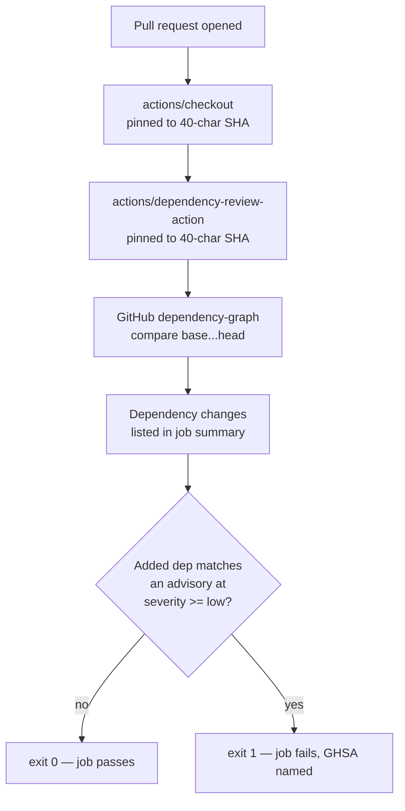

# Add Dependency Review workflow

## Summary

Adds `.github/workflows/dependency-review.yml`, which runs
`actions/dependency-review-action` over every pull request and fails the build
when the PR adds a dependency carrying a known advisory. Closes #11.

The workflow follows the template in the issue, with two changes made after
verifying the template's assumptions against this repository:

- **A job timeout** (`timeout-minutes: 10`) was added, matching `gitleaks.yml`.
- **The step was named** and the file given a header comment recording the
  scope limitation measured below, so the next reader is not misled about what
  this gate does and does not catch here.

Both actions are pinned to 40-character commit SHAs, matching this
repository's supply-chain policy. `fail-on-severity` is deliberately left at
its default (`low`) so every known advisory fails the job loudly rather than
being filtered into silence, and there is no `continue-on-error` or `|| true`.

### What this gate actually catches here — measured, not assumed

This repository declares no package manifests, so its only tracked
dependencies are the GitHub Actions in these workflows. GitHub's dependency
graph does track those (confirmed against the live SBOM endpoint), but this
repository pins every action to a commit SHA — and **the graph records the SHA
itself as the "version", which cannot be compared against a semver advisory
range**. A SHA-pinned action therefore never matches an advisory.

This was proven, not inferred. The same known-vulnerable action
(`tj-actions/changed-files`, GHSA-mrrh-fwg8-r2c3, `<= 45.0.7`) was pushed four
ways to a throwaway branch and run through the real action:

| Reference form | Version the graph reported | Result |
|---|---|---|
| `@45.0.7` (exact tag) | `45.0.7` | **exit 1** — GHSA-mrrh-fwg8-r2c3 |
| `@40.0.0` (exact tag) | `40.0.0` | **exit 1** — two advisories |
| `@v45` (floating tag) | `45.*.*` | exit 0 — range not matched |
| `@a284dc18…` (SHA of v45.0.7) | `a284dc18…` | exit 0 — SHA not matched |

So the advisory gate bites on a concretely versioned dependency — an npm or
similar manifest, or an action pinned to an exact tag — and not on today's
SHA-pinned set. It is worth landing regardless: it is a standing guard for
anything this repository later adds (the npm probe below fails hard), and it
lists every dependency change in the job summary on every PR, SHA-pinned or
not. The header comment in the workflow says exactly this, so nobody later
reads a green check as "the actions were advisory-scanned".

## Evidence

This is a CI-only change with no web interface, so there is no screenshot to
capture. It was verified by executing the real pinned action — same commit SHA
the workflow uses — against this repository's live dependency-graph API.



### Behavioural runs against the live API

`actions/dependency-review-action` was cloned at the pinned SHA
`a1d282b36b6f3519aa1f3fc636f609c47dddb294` and its bundled `dist/index.js` run
directly with a synthesised `pull_request` event, against real commit ranges in
this repository:

| Case | Result |
|---|---|
| `d9cb7b0...ee0156c` — the Semgrep PR, adds one SHA-pinned action | exit **0**, change listed |
| `d9cb7b0...aa480d0` — docs + workflow edit, two SHA-pinned actions | exit **0**, both listed |
| Probe branch adding `package.json` with `lodash@4.17.15`, `minimist@0.0.8` | exit **1** — 8 advisories, incl. critical GHSA-xvch-5gv4-984h |
| Probe branch adding `tj-actions/changed-files@45.0.7` | exit **1** — GHSA-mrrh-fwg8-r2c3 |
| Probe branch adding `tj-actions/changed-files@40.0.0` | exit **1** — GHSA-mcph-m25j-8j63, GHSA-mrrh-fwg8-r2c3 |
| Probe branch, same action SHA-pinned or floating-tagged | exit **0** — see table above |

The npm probe is the one that proves the gate is not decorative: it failed with

```text
package.json » minimist@0.0.8 – Prototype Pollution in minimist (critical severity)
  ↪ https://github.com/advisories/GHSA-xvch-5gv4-984h
::error::Dependency review detected vulnerable packages.
```

The probe branch (`tmp-issue-11-depreview-probe`) existed only for these runs
and has been deleted from the remote; nothing from it is in this PR.

### The dominant PR type here is not affected

This repository's usual pull request is the automated snapshot refresh, which
touches `docs/snapshot.json.gz` only. A range with no manifest or workflow
change returns an empty dependency delta and exits 0, so the gate cannot block
those PRs.

### Supply-chain verification

Both pins were resolved independently rather than trusted from the issue text:

| Reference | Pin | Verified against |
|---|---|---|
| `actions/dependency-review-action` | `a1d282b36b6f3519aa1f3fc636f609c47dddb294` | tag `v5.0.0`, published 2026-05-08 |
| `actions/checkout` | `3d3c42e5aac5ba805825da76410c181273ba90b1` | tag `v7.0.1`, already used by the other two workflows |

`v5.0.0` is the latest release and is far outside the 24-hour dependency
quarantine window. It moves the action's runtime to Node 24, requiring runner
`v2.327.1` or newer; GitHub-hosted `ubuntu-latest` is well past that (the
Semgrep run on this repository last week used runner 2.336.0).

### Structural assertions

The committed YAML was parsed and asserted on (14/14 passed):

```text
PASS triggers on pull_request only
PASS targets all branches
PASS least-privilege permissions
PASS exactly one job
PASS job has a timeout
PASS runs on ubuntu-latest
PASS at least two actions used
PASS all 2 actions pinned to 40-char SHAs
PASS uses actions/dependency-review-action
PASS checks out the repository first
PASS no `continue-on-error` masking a failure
PASS no severity floor that would silence findings
PASS no `|| true` anywhere
PASS no untrusted ${{ }} interpolated into a run: block
```

**`actionlint` exit 0** on `dependency-review.yml`.

### Notes for the reviewer

- `permissions:` is `contents: read` only. The action needs
  `pull-requests: write` solely to post its summary as a PR comment, and
  `comment-summary-in-pr` is left at its default of `never`, so the extra grant
  is not taken. The summary still appears in the job summary.
- The action also reports OpenSSF Scorecard scores and license findings. Both
  are informational at the defaults used here (`warn-on-openssf-scorecard-level:
  3`), and neither was configured — that would be beyond what this issue asks.
- This repository has no `quality.sh`; it holds snapshot data and workflow YAML
  only. `actionlint`, `markdownlint-cli2` and the checks above are the
  applicable gates. `markdownlint-cli2` exits 0.

## Test Plan

The deliverable is a GitHub Actions workflow, and this repository has no test
harness (snapshot data and workflow YAML only). Rather than introduce one for a
single YAML file — the same call made for `semgrep.yml` in #10 — the workflow
was validated by running the real action against real history. Every check
below asserts on an exit code or observable output, never on source text:

- `actionlint .github/workflows/dependency-review.yml` → exit 0.
- Parse the committed YAML and assert the 14 structural properties listed above
  (trigger, permissions, timeout, SHA pinning, checkout ordering, no failure
  masking, no severity floor, no expression injection into `run:`).
- Run the pinned action over `d9cb7b0...ee0156c` and `d9cb7b0...aa480d0` →
  exit 0, with every dependency change listed.
- Run it over a probe branch adding a `package.json` with known-vulnerable
  `lodash` and `minimist` → exit 1, eight advisories named including a critical.
- Run it over probe branches adding `tj-actions/changed-files` at `45.0.7` and
  `40.0.0` → exit 1 in both cases.
- Run it over probe branches adding the same action SHA-pinned and
  floating-tagged → exit 0, establishing the scope limitation documented above.
- Confirm the dependency graph is enabled on this repository by reading its
  live SBOM endpoint.

Once merged, the workflow itself is the ongoing gate: it runs on every pull
request against any branch.
