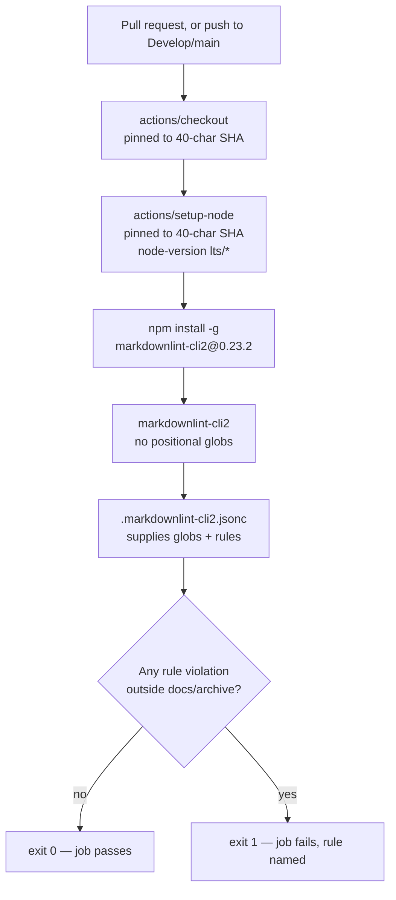

# Add Markdown Lint workflow

## Summary

Adds `.github/workflows/markdown-lint.yml`, which runs `markdownlint-cli2` over
every pull request and every push to `Develop` or `main`, failing the build on
any Markdown rule violation. Closes #12.

The workflow follows the template in the issue. Four things were changed after
verifying the template's assumptions against this repository:

- **The push trigger targets the real branches.** This repository's default
  branch is `Develop` (`main` is the mirror `pages.yml` also publishes from);
  there is no `master`, so the template's `[main, master]` would have left the
  push trigger half dead.
- **A job timeout** (`timeout-minutes: 10`) was added, matching `gitleaks.yml`
  and `dependency-review.yml`.
- **`markdownlint-cli2` is pinned to an exact npm version** (`@0.23.2`) rather
  than installed from the floating `latest` tag. Actions here are pinned to
  40-character SHAs for exactly this reason; leaving the linter unpinned would
  have left a hijackable `npm install -g` in the same job. `0.23.2` is the
  current release, published 2026-07-27 — far outside the 24-hour dependency
  quarantine window.
- **The optional Deno `check-mermaid` steps were left out.** They were guarded
  on `worker/deno/mod.ts`, which belongs to the worker repository and does not
  exist here, so `steps.detect-deno.outputs.present` could only ever be
  `false`. Committing three permanently skipped steps (including a `setup-deno`
  the job would never use) is noise, not a gate. The workflow's header comment
  records the decision so a later reader does not assume Mermaid is validated
  in CI.

The linter is invoked with no positional globs, so file selection and rules
come from `.markdownlint-cli2.jsonc` (added by #10) and a local
`markdownlint-cli2` checks exactly what CI checks.

## Evidence

This is a CI-only change with no web interface, so there is no screenshot to
capture. It was verified by installing the exact pinned version the workflow
installs and running the workflow's real command against real repository
content.



### Behavioural runs

A clean clone was made, `markdownlint-cli2@0.23.2` installed globally through
npm exactly as the workflow's install step does, and the workflow's bare
`markdownlint-cli2` command run against it:

| Case | Result |
| --- | --- |
| Clean tree as committed | exit **0**, 0 issues |
| New top-level `BAD.md` with a missing heading space, no blank line around a heading, and a loose list marker | exit **1**, 3 issues, MD018/MD022/MD030 each named |
| The same `BAD.md` placed under `docs/archive/` | exit **0** — the archive exclusion holds |
| A skipped heading level appended to `README.md` | exit **1**, MD001 and MD012 named |
| A 400-character line | exit **0** — `MD013: false` from the config is honoured |
| `.markdownlint-cli2.jsonc` removed | exit **2**, usage banner — fails loud, never a silent pass |

The last two rows are the ones that prove the config is actually driving the
run rather than the linter falling back to defaults: the long-line case would
fail under stock rules, and removing the config turns the bare invocation into
a hard failure rather than a green no-op.

The third row matters for this repository specifically — `docs/archive/`
carries the PR-summary history (including this file), which is not
retroactively reformatted. Without that exclusion the first PR after this one
would fail on documents it did not touch.

### Structural assertions

The committed YAML was parsed and asserted on (16/16 passed):

```text
PASS triggers on pull_request
PASS pull_request targets all branches
PASS triggers on push to the default branch
PASS least-privilege permissions
PASS exactly one job
PASS job has a timeout
PASS runs on ubuntu-latest
PASS at least two actions used
PASS all actions pinned to 40-char SHAs
PASS checks out the repository first
PASS sets up node
PASS installs a pinned markdownlint-cli2
PASS runs markdownlint-cli2 with no positional globs
PASS no `|| true` masking a failure
PASS no continue-on-error
PASS no untrusted ${{ }} interpolated into a run: block
```

**`actionlint` exit 0** on `.github/workflows/markdown-lint.yml`.

### Supply-chain verification

Every pin was resolved independently rather than trusted from the issue text:

| Reference | Pin | Verified against |
| --- | --- | --- |
| `actions/checkout` | `3d3c42e5aac5ba805825da76410c181273ba90b1` | tag `v7.0.1`, already used by the other workflows |
| `actions/setup-node` | `820762786026740c76f36085b0efc47a31fe5020` | tag `v7.0.0`, published 2026-07-14 |
| `markdownlint-cli2` | `0.23.2` | current npm `latest`, published 2026-07-27 |

### Notes for the reviewer

- `permissions:` is `contents: read` only — the job reads the tree and reports
  through its exit code, so nothing more is needed.
- No `continue-on-error`, no `|| true`: a violation fails the job.
- This repository has no `quality.sh`; it holds snapshot data and workflow YAML
  only. `actionlint` plus `markdownlint-cli2` are the applicable gates, and
  both exit 0 on this branch.
- Once merged, this workflow lints the PR that adds it — and every one after —
  so it is self-gating from the next pull request onward.

## Test Plan

The deliverable is a GitHub Actions workflow, and this repository has no test
harness (snapshot data and workflow YAML only). Rather than introduce one for a
single YAML file — the same call made for `semgrep.yml` in #10 and
`dependency-review.yml` in #11 — the workflow was validated by running its real
command at its pinned version. Every check asserts on an exit code or
observable output, never on source text:

- `actionlint .github/workflows/markdown-lint.yml` → exit 0.
- Parse the committed YAML and assert the 16 structural properties listed above
  (triggers, permissions, timeout, SHA pinning, version pinning, checkout
  ordering, no failure masking, no expression injection into `run:`).
- Install `markdownlint-cli2@0.23.2` via `npm install -g` in a clean clone —
  the workflow's own install step — and run `markdownlint-cli2` on the tree →
  exit 0.
- Plant MD018/MD022/MD030 violations in a new top-level document → exit 1 with
  each rule named.
- Plant the same violations under `docs/archive/` → exit 0, confirming the
  archive exclusion.
- Append a skipped heading level to `README.md` → exit 1 on MD001.
- Add a 400-character line → exit 0, confirming the repository's `MD013: false`
  is applied rather than stock defaults.
- Remove `.markdownlint-cli2.jsonc` and re-run → exit 2, confirming a missing
  config fails loud instead of passing silently.
