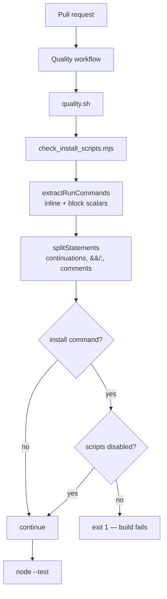

# Disable install-time lifecycle scripts in markdown-lint CI

## Summary

`.github/workflows/markdown-lint.yml` ran
`npm install -g markdownlint-cli2@0.23.2` with npm's default lifecycle-script
behaviour, so `preinstall`/`install`/`postinstall` executed for the package
**and every transitive dependency** on every CI run. A compromised publish of
any package in that tree would have run arbitrary code on the runner before the
linter was ever invoked (CWE-494). The install now passes `--ignore-scripts`.
Closes #22.

markdownlint-cli2 needs no install-time scripts, so this closes the gap with no
behavioural change — verified by installing the exact pinned version with the
flag and running the workflow's real command (below).

The fix is also made permanent rather than one-off. `tools/check_install_scripts.mjs`
scans every workflow, extracts each `run:` command, and fails loud on any
package install (`npm`/`pnpm`/`yarn`) that leaves lifecycle scripts enabled.
`quality.sh` runs it plus the unit tests, and a new `Quality` workflow runs
`quality.sh` on every pull request — so a future workflow cannot reintroduce
the flaw silently.

### Also changed in the touched workflow

The fleet's file-scoped Actions checks apply to any workflow a run modifies, and
`markdown-lint.yml` carried three pre-existing findings. All three are closed
here because the file was being edited anyway, and each narrows the surface the
issue describes:

| Change | Why |
| ------ | --- |
| `persist-credentials: false` on `actions/checkout` | The job never pushes, so the checkout token no longer sits in `.git/config` where a hijacked install step could read it. |
| `milestone/**` added to the `pull_request` branch filter | GitHub branch globs — `*` does not match a `/`, so a pull request targeting `milestone/scan-20260910` (including this one) was merging **unlinted**. |
| `push:` trigger on `Develop`/`main` removed | A lint check belongs on `pull_request`. This was also one of the two triggers the issue's attacker model names — the install no longer runs on a direct push to the default branch. |

## Evidence

This is a CI/CLI-only change with no web interface, so there is no screenshot to
capture. It was verified by running the real commands.

**The workflow's install command still works with the flag** (exact pinned
version, no lifecycle scripts):

```text
$ npm install -g --ignore-scripts markdownlint-cli2@0.23.2
$ markdownlint-cli2
markdownlint-cli2 v0.23.2 (markdownlint v0.41.1)
Finding: **/*.md !docs/archive/** !node_modules/** !.git/**
Summary: 0 issues in 0 files
```

**The regression test observed red, then green.** Against the unfixed workflow:

```text
✖ markdown-lint.yml installs markdownlint-cli2 with lifecycle scripts disabled
  AssertionError [ERR_ASSERTION]: Expected values to be strictly deep-equal:
  + [ { command: 'npm install -g markdownlint-cli2@0.23.2',
  +     file: 'markdown-lint.yml',
  +     reason: 'package install runs lifecycle scripts; add --ignore-scripts' } ]
  - []
ℹ tests 13
ℹ pass 11
ℹ fail 2
```

After adding `--ignore-scripts`, with nothing else changed:

```text
ℹ tests 13
ℹ pass 13
ℹ fail 0
```

**The full gate passes:**

```text
$ ./quality.sh < /dev/null
==> Workflow install-script guard
No unguarded package installs found in .github/workflows.
==> Unit tests
ℹ tests 13
ℹ pass 13
ℹ fail 0
==> All quality checks passed
```

### Original trigger is closed, with no trivial bypass

The issue's trigger is "any CI run of the `markdownlint` job executes
`npm install -g markdownlint-cli2@0.23.2`". That exact command line no longer
exists: the only install in the repository is
`npm install -g --ignore-scripts markdownlint-cli2@0.23.2`, and
`--ignore-scripts` suppresses `preinstall`/`install`/`postinstall` for the root
package and every transitive dependency, so step 3 of the exploit sketch can no
longer execute. Two of the three ways to reopen it are now blocked statically
rather than by convention:

- **Dropping the flag** — `findUnsafeInstalls` reports any `npm`/`pnpm`/`yarn`
  install whose command line carries none of `--ignore-scripts`,
  `NPM_CONFIG_IGNORE_SCRIPTS=true`, or `YARN_ENABLE_SCRIPTS=false`, and
  `quality.sh` exits non-zero on the first finding. The guard walks the whole
  `.github/workflows` directory, so a *new* workflow with an unguarded install
  fails the same gate — it is not keyed to this file or this package.
- **Hiding the install** — the guard splits each `run:` command on `&&`, `||`
  and `;`, joins backslash continuations, skips leading `VAR=value`
  assignments, and reads block scalars as well as inline ones, so an install
  chained after another command, wrapped over several lines, or written in a
  `run: |` block is still seen. Shell comments are skipped, so a commented-out
  install is not a false positive.
- **What is deliberately *not* covered** — an install that disables scripts via
  an ambient `.npmrc` is still reported. That is conservative on purpose: the
  guarantee has to be visible at the call site. The guard is also a static
  check over the committed YAML, so it cannot see a script fetched and executed
  at run time; the remaining defence there is the SHA pinning and the exact npm
  version pin the workflow already carries.

The blast radius bound the issue relies on is unchanged and unweakened — the
job still declares `permissions: contents: read`, now at both workflow and job
level, and no secrets are scoped to it.

### How the guard fits together



## Test Plan

New file `tests/check_install_scripts.test.mjs` (Node's built-in test runner,
no dependencies). Every test calls the real exported functions with real input
and asserts on the returned value.

**Regression test for this issue** —
`tests/check_install_scripts.test.mjs::markdown-lint.yml installs markdownlint-cli2 with lifecycle scripts disabled`
reads the repository's actual `.github/workflows/markdown-lint.yml` and asserts
`findUnsafeInstalls` returns no findings. It **fails against the unfixed
workflow** (output quoted above) and **passes after** `--ignore-scripts` is
added — that red-then-green sequence was observed, not inferred.

Supporting tests:

| Test | Covers |
| ---- | ------ |
| `extractRunCommands reads an inline run scalar` | Happy path, inline `run:` form. |
| `extractRunCommands reads a block scalar and stops at the next key` | Block `run: \|` form, and that the following `env:` key is not swallowed. |
| `extractRunCommands returns nothing for a workflow with no run steps` | Edge case — `uses:`-only workflow. |
| `findUnsafeInstalls flags an unguarded global npm install` | Error path — the flaw itself, with the reported file and command asserted. |
| `findUnsafeInstalls accepts an install carrying --ignore-scripts` | The fix is recognised. |
| `findUnsafeInstalls accepts the npm_config_ignore_scripts environment form` | The environment-variable spelling, with a leading `VAR=value` assignment. |
| `findUnsafeInstalls flags pnpm and yarn installs too` | General case — not special-cased to npm or to this package. |
| `findUnsafeInstalls ignores non-install package-manager commands` | `npm run build && npm test` is not an install (no false positive). |
| `findUnsafeInstalls ignores shell comments` | A commented-out install is not a finding. |
| `findUnsafeInstalls follows a backslash line continuation` | The flag is found when the command wraps over three lines. |
| `findUnsafeInstalls returns nothing for empty input` | Edge case — empty document. |
| `no workflow in this repository installs packages with lifecycle scripts enabled` | Directory-wide regression guard across all five workflows. |

Run with `./quality.sh` (or `node --test "tests/**/*.test.mjs"`): 13 tests, 13
passing, ~40 ms.

## Pre-PR security self-check

- **Input validation** — `extractRunCommands` rejects a non-string input with a
  `TypeError` rather than coercing it.
- **Secrets** — no hidden paths staged; the only files added are `quality.sh`,
  `tools/`, `tests/`, this summary, and two workflow files.
- **Injection surface** — the guard only reads files; it executes nothing it
  parses and shells out nowhere. `quality.sh` runs `set -euo pipefail` and
  passes no interpolated input to a shell.
- **Error handling** — every stage fails loud: the guard exits 1 listing each
  finding, and `quality.sh` aborts on the first non-zero exit, so a broken
  stage cannot be reported as a pass.
- **Dependencies** — none added. The guard and its tests use Node built-ins
  only, so the fix introduces no new supply-chain surface of its own.
- **Workflow permissions** — both workflows declare `contents: read` at
  workflow and job level; both checkouts set `persist-credentials: false`; all
  action pins are 40-character SHAs verified this run against
  `repos/actions/checkout/commits/v7.0.1` and
  `repos/actions/setup-node/commits/v7.0.0`.
