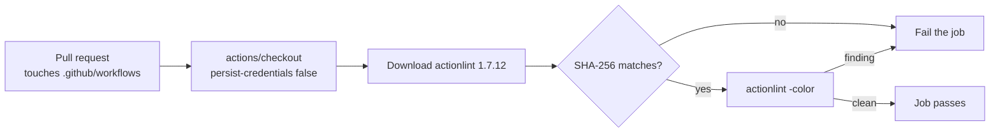

# Add an actionlint CI gate for workflow YAML

## Summary

Adds `.github/workflows/actionlint.yml`, which runs
[`actionlint`](https://github.com/rhysd/actionlint) over every workflow in
`.github/workflows/` on every pull request and fails the build on any finding.
Before this change no workflow invoked a linter for workflow YAML, so a schema
error, an invalid `${{ }}` expression, a bad `runs-on` label, or a shell bug
inside a `run:` block was only discovered when the broken workflow next ran.
Closes #25.

Four decisions worth a reviewer's attention:

- **Installed from a pinned release, not a third-party action.** The issue
  suggested `rhysd/actionlint@v1`, but `rhysd/actionlint` publishes a CLI
  release, not a composite action. Rather than introduce an unrelated
  third-party wrapper action, the job downloads
  `actionlint_1.7.12_linux_amd64.tar.gz` over TLS and verifies it against a
  recorded SHA-256 before executing it — the same install pattern
  `gitleaks.yml` already uses for its open-source CLI fallback. The version is
  exact (`ci-install-pins`), and a tampered or repointed archive fails the
  checksum step loudly instead of running.
- **`branches: ["**"]`, not `["*"]`.** A `*` filter stops at the first `/`, so
  it does not match `milestone/<slug>` branches — this pull request's own base
  is `milestone/scan-20260910`, which a `*` filter would leave unchecked.
- **Pull request trigger only.** A lint gate that also ran on push to `Develop`
  would be reporting a regression that had already landed; the check belongs on
  the pull request that introduces it.
- **`persist-credentials: false` on checkout.** The job only reads the tree.

`actionlint` is invoked with no positional arguments, so it discovers the same
file set a local `actionlint` run does — CI and a developer's machine check
exactly the same workflows. `shellcheck` is preinstalled on the GitHub-hosted
runner, so the `run:`-block shellcheck coverage the issue asks for is active.

### Where the gate sits



## Evidence

This is a CI-only change with no web interface, so there is no screenshot to
capture. It was verified by running the exact linter version and command the
workflow runs, against this repository's real workflow files.

**The gate is green on the committed tree.** `actionlint` 1.7.12 over all six
workflows, including the new one:

```text
$ actionlint -color
$ echo $?
0
```

**The gate is red on a regression.** Three regression classes were injected
into a scratch copy of `.github/workflows/` — an unknown `runs-on` label, an
undefined `github.*` property in an expression, and an unquoted variable in a
`run:` block — and `actionlint` caught all three and exited `1`:

```text
.github/workflows/gitleaks.yml:65:9: shellcheck reported issue in this script:
  SC2086:info:4:12: Double quote to prevent globbing and word splitting [shellcheck]
.github/workflows/gitleaks.yml:65:9: shellcheck reported issue in this script:
  SC2086:info:4:20: Double quote to prevent globbing and word splitting [shellcheck]
.github/workflows/markdown-lint.yml:35:14: label "ubunut-latest" is unknown [runner-label]
.github/workflows/markdown-lint.yml:45:29: property "no_such_field" is not defined
  in object type {...} [expression]
regressed exit=1
```

Restoring the unmodified files returned exit `0`, so the failure tracked the
injected faults rather than an unrelated condition.

**The install step was executed as written.** The workflow's download,
checksum, and extract lines were run verbatim:

```text
actionlint_1.7.12_linux_amd64.tar.gz: OK
actionlint: ELF 64-bit LSB executable, x86-64, statically linked, Go Bui...
```

and a deliberately wrong expected digest failed the step loudly rather than
proceeding:

```text
actionlint_1.7.12_linux_amd64.tar.gz: FAILED
sha256sum: WARNING: 1 computed checksum did NOT match
tampered-checksum exit=1
```

**Supply-chain checks.** `actionlint` 1.7.12 was published 2026-03-30, far
outside the 24-hour dependency quarantine window. `actions/checkout` is pinned
to `3d3c42e5aac5ba805825da76410c181273ba90b1` (v7.0.1) — the same SHA already
used by `markdown-lint.yml`, `semgrep.yml`, `dependency-review.yml`, and
`gitleaks.yml`, so no new SHA was resolved or invented for this change.

## Test Plan

This repository has no test framework and no `quality.sh`; its workflow files
are the artefact under test, and `actionlint` is the check that exercises them.

- Ran `actionlint -color` against the committed tree (all six workflows,
  including `.github/workflows/actionlint.yml` itself) — exit `0`.
- Ran `actionlint` against a scratch tree carrying three injected regressions
  (`runner-label`, `expression`, and `shellcheck` classes) — exit `1` with a
  finding for each; restoring the clean files returned exit `0`.
- Executed the workflow's install step verbatim (download, `sha256sum -c`,
  `tar -xzf`) and confirmed a mismatched digest fails the step non-zero.
- Ran `markdownlint-cli2` semantics unchanged: this summary lives under
  `docs/archive/**`, which `.markdownlint-cli2.jsonc` excludes.
