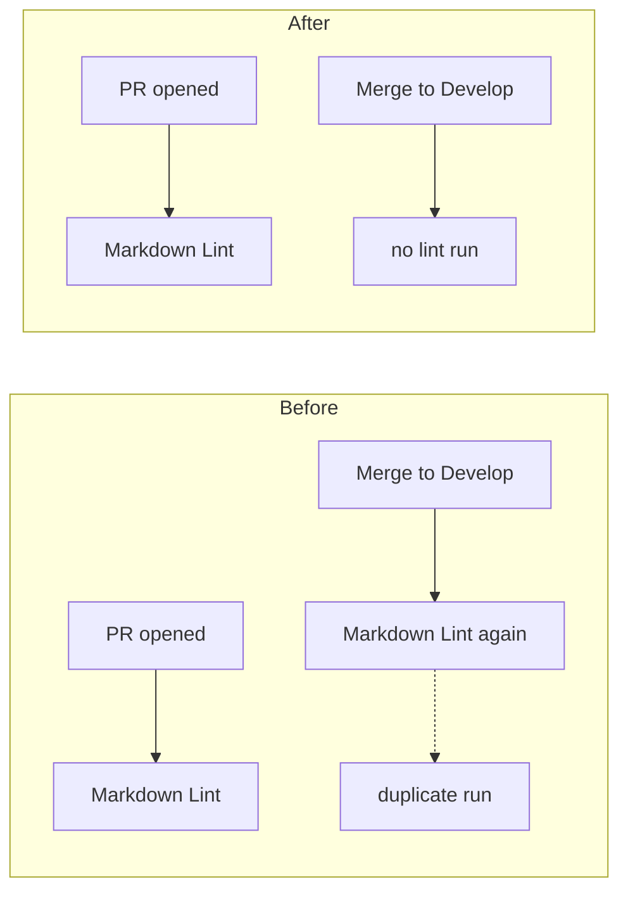

## Summary

`.github/workflows/markdown-lint.yml` is a checker: it lints Markdown and
gates the pull request. It also fired on every push to the default branch
`Develop`, so each merge re-ran the identical lint that had already passed on
the PR — duplicated CI minutes, and a chance of a red tick on `Develop` for a
check that was already green. The `push:` trigger is removed; the workflow now
runs on `pull_request` only. `pages.yml` is a publisher, not a checker, and
keeps its push trigger.

Two further findings on the same file were fixed in the same edit, because a
workflow file this run touches has to satisfy the whole file-scoped Actions
check set:

- `pull_request.branches` was `["*"]`, which stops at the first `/` and so
  never matched `milestone/<slug>`. Widened to `["**"]`, matching
  `actionlint.yml`. Without it this very PR — targeting
  `milestone/scan-20260910` — would have gone unlinted, leaving the "gate the
  PR instead of the push" fix vacuous on exactly the branches the milestone
  flow uses. Closes #32.
- The `actions/checkout` step persisted the workflow token although the job
  only reads the tree. The step now sets `persist-credentials` to `false`.
  Closes #28.

Closes #26.

## Evidence

Backend/CI change with no web interface to screenshot. Evidence is the parsed
workflow and the workflow linter.

Trigger reachability, asserted against the parsed YAML (GitHub glob semantics:
`*` does not cross `/`, `**` does):

| Event | Before | After |
| --- | --- | --- |
| push to `Develop` | lint runs (duplicate) | no run |
| push to `main` | lint runs | no run |
| PR from `issue-26-…` | lint runs | lint runs |
| PR from `milestone/scan-20260910` | **no run** | lint runs |

```text
$ python3 verify_triggers.py          # against HEAD (unfixed)
triggers: ['pull_request', 'push']
AssertionError: push trigger still present     # exit 1

$ python3 verify_triggers.py          # after the fix
triggers: ['pull_request']
pull_request branches: ['**']
  PR from 'Develop' triggers lint: True
  PR from 'issue-26-foo' triggers lint: True
  PR from 'milestone/scan-20260910' triggers lint: True
checkout opts out of persisting its token: True
OK                                             # exit 0

$ actionlint -color                            # exit 0, no findings
```



## Test Plan

This repository has no test suite — it is a published snapshot plus its CI
definitions — so the checks below are the ones CI itself runs, executed
locally against the edited file.

- `actionlint` over `.github/workflows/` — exit 0, no findings (the same gate
  `.github/workflows/actionlint.yml` runs on every PR).
- Parsed-YAML assertions on `.github/workflows/markdown-lint.yml`: no `push`
  trigger, `pull_request.branches` matches `Develop`, a plain issue branch and
  `milestone/scan-20260910`, and the checkout step sets
  `persist-credentials` to `false`. Run against `HEAD` first, where it fails on
  the `push` trigger, then against the fix, where it passes.
- `markdownlint-cli2` over the tracked Markdown — 0 issues. (`docs/archive/**`
  is excluded by `.markdownlint-cli2.jsonc`, so this summary file itself is
  outside the linted set.)
