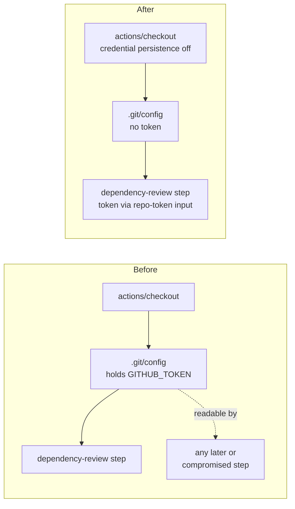

## Summary

Job `dependency-review` checked the tree out with `actions/checkout` and left
the workflow's `GITHUB_TOKEN` in `.git/config` as an auth header, where any
later step in the job — a compromised action, an injected script — could read
it and act as the token. The job only reads the tree: it never pushes and
fetches no private submodule, and `actions/dependency-review-action` receives
its token through its own `repo-token` input rather than from `.git/config`.
The checkout step now switches credential persistence off, so the token is
never written to disk. Closes #27.

One further finding on the same file was fixed in the same edit, because a
workflow file this run touches has to satisfy the whole file-scoped Actions
check set:

- `pull_request.branches` was `["*"]`, which stops at the first `/` and so
  never matched `milestone/<slug>`. Widened to `["**"]`, matching
  `actionlint.yml` and `markdown-lint.yml`. Without it this very pull request
  — based on `milestone/scan-20260910` — would have merged with the dependency
  gate silently skipped, which is the same fault PR #48 fixed in
  `markdown-lint.yml`. No open issue tracks it for this file, so it is fixed
  here rather than left for a future scan.

## Evidence

CI-only change with no web interface to screenshot. Evidence is the parsed
workflow plus the workflow linter that CI itself runs.

```text
$ python3 verify_dr.py            # against HEAD (unfixed)
pull_request branches: ['*']
  PR from 'Develop' triggers dependency review: True
  PR from 'issue-27-foo' triggers dependency review: True
  PR from 'milestone/scan-20260910' triggers dependency review: False
checkout persist-credentials: None
FAIL: branch filter does not match 'milestone/scan-20260910'
FAIL: checkout still persists the workflow token on disk     # exit 1

$ python3 verify_dr.py            # after the fix
pull_request branches: ['**']
  PR from 'Develop' triggers dependency review: True
  PR from 'issue-27-foo' triggers dependency review: True
  PR from 'milestone/scan-20260910' triggers dependency review: True
checkout persist-credentials: False
OK                                                           # exit 0

$ actionlint -color                                          # exit 0, no findings
```

Where the token used to live, and where it does not any more:



## Test Plan

This repository has no test suite — it is a published snapshot plus its CI
definitions — so the checks below are the ones CI itself runs, executed
locally against the edited file.

- Parsed-YAML assertions on `.github/workflows/dependency-review.yml`: the
  checkout step disables credential persistence, and
  `pull_request.branches` matches `Develop`, a plain issue branch and
  `milestone/scan-20260910`. Run against `HEAD` first, where it fails on both
  assertions, then against the fix, where it passes.
- `actionlint` over `.github/workflows/` — exit 0, no findings (the same gate
  `.github/workflows/actionlint.yml` runs on every pull request).
- `markdownlint-cli2` over the tracked Markdown — unchanged; this summary
  lives under `docs/archive/**`, which `.markdownlint-cli2.jsonc` excludes.
