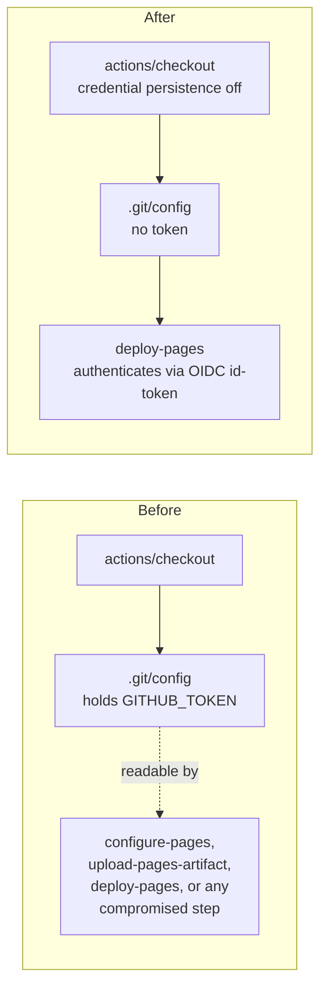

## Summary

Job `deploy` in `.github/workflows/pages.yml` checked the tree out with
`actions/checkout` and left the workflow's `GITHUB_TOKEN` in `.git/config` as
an auth header, where any later step in the job — a compromised action, an
injected script — could read it and act as the token. The job only reads the
tree: it uploads `docs/` as a Pages artefact and deploys it, never pushes back
to the repository and fetches no private submodule, and `actions/deploy-pages`
authenticates through the job's OIDC `id-token` rather than through
`.git/config`. The checkout step now switches credential persistence off, so
the token is never written to disk. Closes #29.

No other file-scoped Actions finding applies to this file: every `uses:` is
pinned to a 40-character SHA with a version comment, the workflow declares
least-privilege `permissions:`, the `push` trigger belongs to a deploy
workflow (not a test/lint/scan one), there is no `pull_request` branch filter
to widen, the artefact upload names `docs` rather than the whole workspace,
and there are no `run:` steps.

## Evidence

CI-only change with no web interface to screenshot. Evidence is the parsed
workflow plus `actionlint`, the same gate `.github/workflows/actionlint.yml`
runs on every pull request.

```text
$ python3 verify_pages.py          # against HEAD (unfixed)
checkout persist-credentials: None
FAIL: checkout still persists the workflow token on disk
steps: ['actions/checkout', 'actions/configure-pages', 'actions/upload-pages-artifact', 'actions/deploy-pages']
FAILED                                                       # exit 1

$ python3 verify_pages.py          # after the fix
checkout persist-credentials: False
steps: ['actions/checkout', 'actions/configure-pages', 'actions/upload-pages-artifact', 'actions/deploy-pages']
OK                                                           # exit 0

$ actionlint -color                                          # exit 0, no findings
```

Where the token used to live, and where it does not any more:



## Test Plan

This repository has no test suite — it is a published snapshot plus its CI
definitions — so the checks below are the ones CI itself runs, executed
locally against the edited file.

- Parsed-YAML assertions on `.github/workflows/pages.yml`: the checkout step
  disables credential persistence, the four deploy steps are unchanged and in
  order, and every action reference is pinned to a 40-character SHA. Run
  against `HEAD` first, where it fails on the persistence assertion, then
  against the fix, where it passes.
- `actionlint` over `.github/workflows/` — exit 0, no findings.
- `markdownlint-cli2` over the tracked Markdown — unchanged; this summary
  lives under `docs/archive/**`, which `.markdownlint-cli2.jsonc` excludes.
