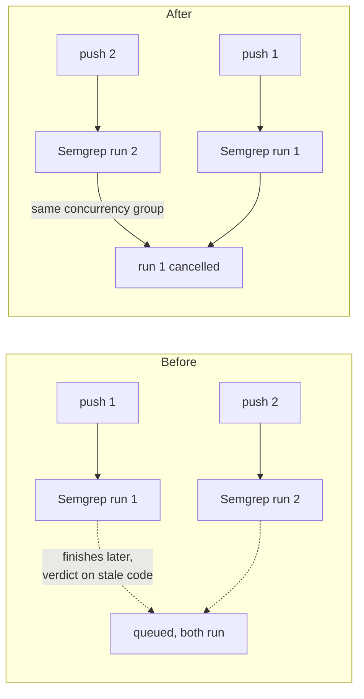

## Summary

Every PR-triggered CI workflow in this repository queued its runs instead of
superseding them: a second push to an open pull request started a second
`Gitleaks`/`Semgrep`/`Markdown Lint`/`Dependency Review` run while the first
was still going. For the two workflows that download a container or a CLI that
is a straight waste of CI minutes, and the stale run's verdict lands on the
pull request after the newer commit's — a green tick that refers to code that
is no longer there. Only `pages.yml` declared a `concurrency:` group.

Each PR-triggered workflow now declares the standard cancel-in-progress group
at the top level:

```yaml
concurrency:
  group: ${{ github.workflow }}-${{ github.ref }}
  cancel-in-progress: true
```

On a `pull_request` event `github.ref` is `refs/pull/<n>/merge`, so the group
key is unique per workflow **and** per pull request: a push cancels only the
superseded run of that workflow on that pull request, never a run on another
pull request and never another workflow's run. `pages.yml` is untouched — it
is a publisher with its own `pages` group, not a PR check.

Closes #42.

### Scope

The issue named four files. `actionlint.yml` was added by #25 after that audit
ran and is the same kind of workflow with the same gap, so it is fixed here
too rather than left to be re-filed by the next audit.

Two further findings were fixed on the files this change already touches,
because a workflow file a run edits has to satisfy the whole file-scoped
Actions check set (the same reason given in `pr-summary-26.md`):

- `gitleaks.yml` and `semgrep.yml` filtered `pull_request` on `branches:
  ["*"]`, which stops at the first `/` and so never matched
  `milestone/<slug>`. Widened to `["**"]`. Without it these two checks —
  secret scanning and SAST — would have stayed silent on this very pull
  request, which targets `milestone/scan-20260910`. Closes #31. Closes #33.
- The `actions/checkout` steps in both jobs persisted the workflow token in
  `.git/config` as an auth header although neither job pushes. Both now set
  `persist-credentials` to `false`. Closes #30. The repository is public, so
  `gitleaks.yml`'s anonymous base-branch fetch still resolves, and the
  licensed `gitleaks-action` receives its token through `env:` either way.

## Evidence

Backend/CI change with no web interface to screenshot. Evidence is the parsed
workflow YAML and the workflow linter — the same linter `actionlint.yml` runs
on every pull request.

```text
$ python3 verify_concurrency.py          # against HEAD (unfixed)
FAIL:
  - actionlint.yml: no top-level `concurrency:` group
  - dependency-review.yml: no top-level `concurrency:` group
  - gitleaks.yml: no top-level `concurrency:` group
  - gitleaks.yml: PR from 'milestone/scan-20260910' unmatched by branches ['*']
  - gitleaks.yml: job gitleaks checkout persists credentials
  - markdown-lint.yml: no top-level `concurrency:` group
  - semgrep.yml: no top-level `concurrency:` group
  - semgrep.yml: PR from 'milestone/scan-20260910' unmatched by branches ['*']
  - semgrep.yml: job semgrep checkout persists credentials
                                                          # exit 1

$ python3 verify_concurrency.py          # after the fix
actionlint.yml: group='${{ github.workflow }}-${{ github.ref }}' cancel-in-progress=True
dependency-review.yml: group='${{ github.workflow }}-${{ github.ref }}' cancel-in-progress=True
gitleaks.yml: group='${{ github.workflow }}-${{ github.ref }}' cancel-in-progress=True
markdown-lint.yml: group='${{ github.workflow }}-${{ github.ref }}' cancel-in-progress=True
semgrep.yml: group='${{ github.workflow }}-${{ github.ref }}' cancel-in-progress=True

OK                                                        # exit 0

$ actionlint -color                                       # exit 0, no findings
```

What changes on a second push to an open pull request:



## Test Plan

This repository has no test suite and no `quality.sh` — it is a published
snapshot plus its CI definitions — so the checks below are the ones CI itself
runs, executed locally against the edited files.

- Parsed-YAML assertions over `.github/workflows/*.yml` (no source grepping):
  every workflow that triggers on `pull_request` declares a top-level
  `concurrency` group equal to `${{ github.workflow }}-${{ github.ref }}` with
  `cancel-in-progress: true`; and, for each edited file, the `pull_request`
  branch filter matches `Develop`, a plain issue branch and
  `milestone/scan-20260910` under GitHub glob semantics (`*` does not cross
  `/`, `**` does), and no read-only `actions/checkout` persists credentials.
  Run against `HEAD` first, where it fails on all nine findings above, then
  against the fix, where it passes. The script is a throwaway harness, not a
  deliverable, so it is not committed — its full output is quoted above.
- `actionlint` over `.github/workflows/` — exit 0, no findings.
- `markdownlint-cli2` is unaffected: no tracked Markdown outside
  `docs/archive/**` changed, and that path is excluded by
  `.markdownlint-cli2.jsonc`.
