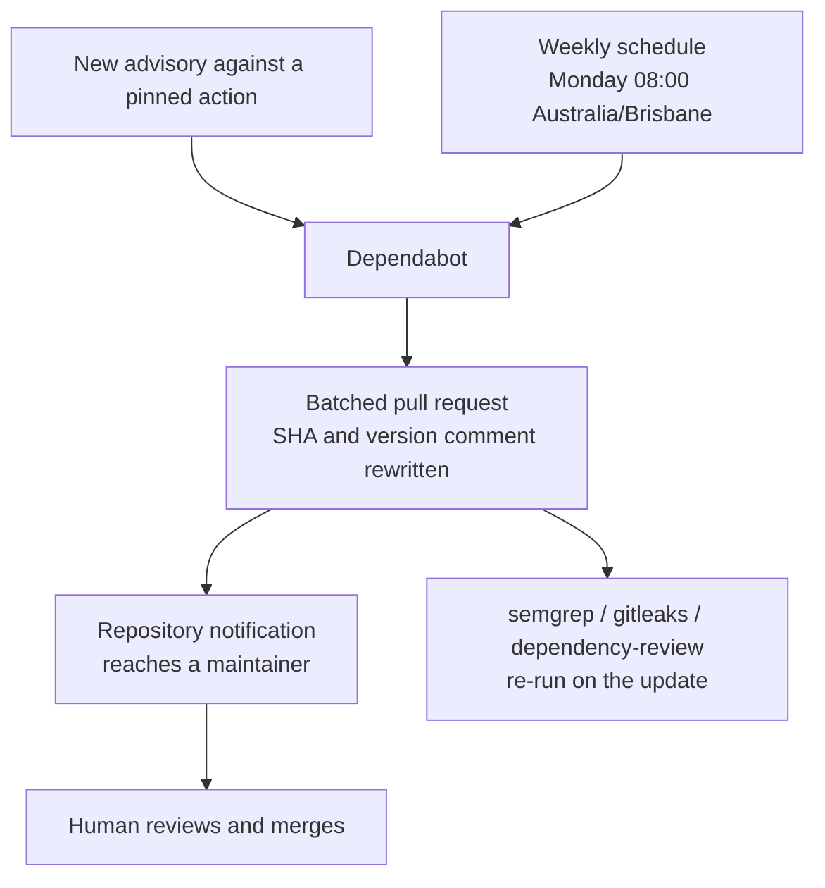

# Add a Dependabot advisory channel so security signals reach a human

## Summary

Nothing in this repository routed a security-relevant signal to a person. Three
security jobs already gate every pull request — `semgrep`, `gitleaks` and
`dependency-review` — but a red job is only a red X on the pull request itself,
there was no advisory subscription of any kind, and no `SECURITY.md` naming who
picks one up. That is the OWASP A09:2025 alerting-readiness gap: the security
value of a scanner is not the scan, it is what happens when the scan finds
something.

This change adds `.github/dependabot.yml` — a single `github-actions` update
entry on a weekly schedule. Closes #45.

The issue offered three paths (a Dependabot config, an `if: failure()`
notification step on one of the security jobs, or a short `SECURITY.md`) and
states that any single path closes the finding. Dependabot is the one picked,
for three reasons:

- **It is an automatic channel, not a document.** Once a config exists GitHub
  schedules the updater against the repository, and the pull requests it opens
  — including the out-of-band ones it raises when an advisory lands against
  something in the tree — arrive as ordinary repository notifications. A
  `SECURITY.md` records who *should* be told; this actually tells them.
- **It changes no workflow privileges.** The `if: failure()` path needs
  `issues: write` on a `pull_request`-triggered job, which is exactly the
  privilege creep tracked separately under `github-actions-audit` (#27–#37).
  It would also fail silently on fork pull requests, whose tokens are read-only.
- **It closes part of the auto-update gap too**, as the issue notes.

### Scope, measured rather than assumed

This repository declares no package manifests, so its only tracked dependencies
are the GitHub Actions referenced by the workflows — the same scope
`dependency-review.yml` already records in its own header. `github-actions` is
therefore the only ecosystem with anything to update; adding a manifest later
means adding its ecosystem to the config.

Every action here is pinned to a 40-character commit SHA with the tag it
resolves to in a trailing comment. The `github-actions` updater understands that
shape and rewrites both the SHA and the comment, so the pins stay pinned and
stay current instead of drifting until an audit notices. Updates are grouped
under a single `patterns: ["*"]` group, so the repository gets at most one
batched pull request a week rather than a wall of single-action ones — a wall is
how a genuine advisory update gets skimmed past, which is the failure mode this
file exists to prevent.

No workflow file is added or changed by this pull request.

### Where the signal now goes



## Evidence

Backend/CI change with no web interface to screenshot, so the evidence is the
check that defines the finding plus schema validation of the file added.

A checker was written first, encoding the finding's own evidence list: the
repository passes `SCR-SEC-ALERTING` when at least one of a well-formed
Dependabot config, a Renovate config with vulnerability alerts, a workflow
failure-notification step, or a `SECURITY.md` is present. It was run red against
the unfixed tree, then green after the file was added.

```text
$ python3 verify_alerting.py .          # against HEAD (unfixed)
FAIL: SCR-SEC-ALERTING — no alerting path for security-relevant signals
  - dependabot advisory/update channel: no .github/dependabot.yml
  - renovate vulnerability alerts: no renovate config
  - workflow failure notification: no workflow has an `if: failure()` notification step
  - documented escalation owner: no SECURITY.md
exit 1

$ python3 verify_alerting.py .          # with .github/dependabot.yml
PASS: at least one alerting path exists
  - dependabot advisory/update channel: dependabot.yml: 1 update entries (github-actions)
exit 0
```

The checker validates structure, not mere presence — pointed at a tree whose
config declares the wrong schema version it reports the specific defect and
still fails:

```text
$ python3 verify_alerting.py /tmp/negtest   # same file, version changed to 1
FAIL: SCR-SEC-ALERTING — no alerting path for security-relevant signals
  - dependabot advisory/update channel: dependabot.yml: version must be 2, got 1
exit 1
```

The committed file was then validated against the official Dependabot v2 schema
(`https://json.schemastore.org/dependabot-2.0.json`), key by key and enum by
enum, because a malformed config is silently ignored by GitHub and would leave
the finding open while looking closed:

```text
top-level keys known:      True
update entry unknown keys: none
schedule unknown keys:     none
package-ecosystem in enum: True
schedule interval in enum: True
schedule day in enum:      True
schedule time matches hh:mm pattern: True
timezone in IANA enum:     True
groups shape ok:           True
```

`actionlint` exits 0 on the tree (no workflow changed). The checker is a
verification harness, not a repository artefact, and is not committed — this
repository has no test framework, matching the approach recorded in
`pr-summary-25.md` and `pr-summary-42.md`.

## Quality gate

This repository has no `quality.sh`; its gate is the CI workflow set. The two
checks that apply to this change were run locally: `actionlint` (exit 0) and
`markdownlint-cli2`, which covers this summary's own Markdown.

## Test Plan

- Ran the `SCR-SEC-ALERTING` checker against the unfixed tree and observed it
  fail with all four paths absent.
- Ran the same checker after adding `.github/dependabot.yml` and observed it
  pass.
- Ran the checker against a copy of the tree carrying a deliberately invalid
  config (`version: 1`) and observed it fail with the specific defect named,
  confirming it validates shape rather than existence.
- Validated `.github/dependabot.yml` against the SchemaStore Dependabot v2
  schema: every key known, every enumerated value valid, the `time` value
  matching the schema's `hh:mm` pattern.
- Ran `actionlint` over `.github/workflows/` — exit 0.
