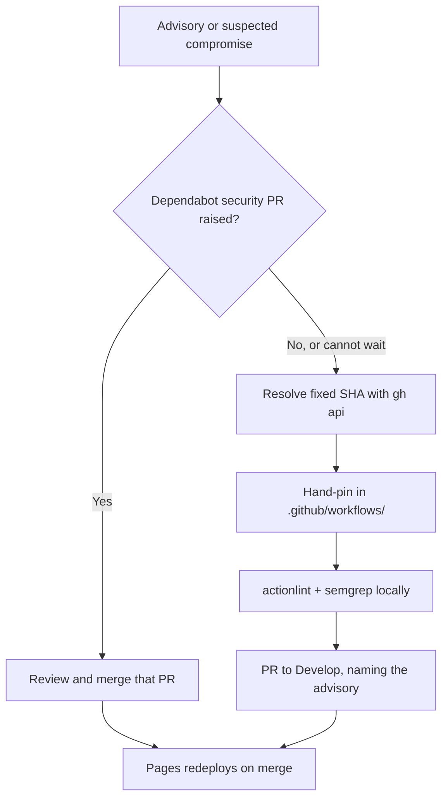

## Summary

Added a `SECURITY.md` at the repository root giving a private disclosure contact
and a short emergency dependency-bump runbook, and a two-line **Security**
pointer in `README.md` so the policy is reachable from the front page. Closes
#46.

The content is scoped to what this repository actually is — a data-fixture repo
with no package manifest, whose only tracked dependencies are the GitHub Actions
pinned by SHA under `.github/workflows/`:

- **Disclosure contact** — `security@stsoftware.com.au` plus GitHub's private
  "Report a vulnerability" flow, matching the wording already used by the six
  sibling NEAT-AI repositories (each of which already ships a `SECURITY.md`).
- **Scope table** — what belongs here versus what belongs against NEAT-AI or
  NEAT-AI-Explore, and the note that there is no release line: a fix is live
  once Pages redeploys.
- **Emergency bump runbook** — resolve the fixed SHA with `gh api`, hand-pin it
  in the workflow with its version comment, verify with `actionlint` and
  `semgrep`, and open a PR to `Develop` naming the advisory. It states plainly
  that Dependabot ignores its seven-day `cooldown` for *security* updates, so the
  routine path already fast-tracks an advisory and the cooldown in
  `.github/dependabot.yml` must **not** be lowered to force a fix through.

## Evidence

No web interface changed, so there is no screenshot to capture — this is a
documentation-only change to two Markdown files. The repository has no test
suite (it ships data fixtures, not code), so the evidence is that the runbook's
own commands were executed against this tree and pass:

```text
$ actionlint < /dev/null
actionlint exit=0

$ semgrep --config p/default .github/ --quiet < /dev/null
(no findings)

$ markdownlint-cli2 < /dev/null
Summary: 0 issues in 0 files
```

Every factual claim in the new document was checked against the tree rather than
assumed: the seven-day `cooldown` and the `github-actions`-only ecosystem come
from `.github/dependabot.yml`; the SHA-pin-plus-version-comment shape from
`grep -rn "uses:" .github/workflows/`; the check names from the five workflow
files; and the Pages-on-merge behaviour from `pages.yml`.

The decision path the runbook encodes:



## Test Plan

- No automated tests added — the repository has no test harness, and the change
  adds documentation only.
- `markdownlint-cli2 < /dev/null` — the repository's own Markdown gate (the
  `markdown-lint` workflow) — passes over both changed files.
- `actionlint < /dev/null` and `semgrep --config p/default .github/ --quiet`
  were run to confirm the commands the runbook instructs a responder to use are
  correct and green on this tree.

<!-- vibe-quality-gate-skipped reason="no quality script exists in this repository — the tree holds LICENSE, README.md, SECURITY.md, docs/ and .github/ only; the equivalent per-check gates (markdownlint-cli2, actionlint, semgrep) were run individually and all pass" -->
