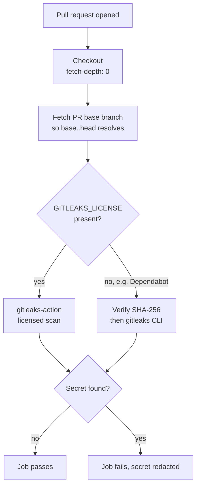

# Add Gitleaks Secrets Detection workflow

## Summary

Adds `.github/workflows/gitleaks.yml`, which scans pull request diffs for
committed secrets and fails the build when one is found. Closes #9.

The workflow follows the template in the issue, with two branches so it works on
every PR this repository receives:

- **Licensed path** — when the organisation Gitleaks Pro licence secret is
  present, the upstream `gitleaks/gitleaks-action` runs so the licence is
  applied.
- **Open-source fallback** — Dependabot-authored PRs do not receive Actions
  secrets, so the licence is empty and the action would exit with `ErrLicence`.
  Those runs fall back to the free gitleaks CLI, which needs no licence.

The licence is exposed at *job* level as `env.GITLEAKS_LICENSE` because the
`secrets` context is not available in `if:` conditions, but `env` is.

### Supply-chain hardening

All three external references were verified independently rather than trusted
from the issue text:

| Reference | Pin | Verified against |
|---|---|---|
| `actions/checkout` | `3d3c42e5aac5ba805825da76410c181273ba90b1` | resolves to tag `v7.0.1` |
| `gitleaks/gitleaks-action` | `e0c47f4f8be36e29cdc102c57e68cb5cbf0e8d1e` | resolves to tag `v3.0.0` |
| gitleaks CLI 8.30.1 tarball | `551f6fc8…2470eb` | official `gitleaks_8.30.1_checksums.txt` |

Actions are pinned to 40-character commit SHAs so a hijacked tag cannot
exfiltrate CI secrets, and the fallback verifies the downloaded tarball's
SHA-256 before executing it. Permissions are least-privilege (`contents: read`,
`pull-requests: read`) and the job carries a 10-minute timeout.



## Evidence

This is a CI-only change with no web interface, so there is no screenshot to
capture. It was verified by executing the workflow's own scan command against
real git history.

**The workflow ran green on this very PR** ([run 32346435290][run], 1m44s). It
triggers on `pull_request`, so it gates the change that introduces it. The
organisation licence secret is present on this repository, so the licensed
branch ran and the fallback was skipped — confirming the `if:` branching works
against the real `secrets` context:

```text
success  Run actions/checkout@3d3c42e5aac5ba805825da76410c181273ba90b1
success  Fetch base branch
success  Gitleaks (licensed action)
skipped  Gitleaks (open-source CLI fallback)
```

[run]: https://github.com/stSoftwareAU/NEAT-AI-Snapshot/actions/runs/32346435290

The fallback branch cannot be exercised by a normal PR here (the licence is
always injected), so it was verified locally instead — see the behavioural runs
below.

**Structural assertions** — the committed YAML was parsed and asserted on
(10/10 passed):

```text
PASS triggers on pull_request only
PASS least-privilege permissions
PASS job has a timeout
PASS licence exposed at job level for if: branching
PASS all 2 actions pinned to 40-char SHAs
PASS licensed/fallback branches mutually exclusive and exhaustive
PASS fallback verifies tarball checksum before use
PASS fallback redacts secrets in output
PASS fallback fails the build on a leak
PASS fallback fails loud
```

**`actionlint` exit 0** on the new workflow (shellcheck is on `PATH`, so the
`run:` block was shell-checked too).

**Behavioural runs of the exact fallback command** —
`gitleaks git --redact --no-banner --exit-code 1 --log-opts="<base>..<head>" .`:

| Case | Result |
|---|---|
| Clean commit range | exit **0** — job passes |
| Range containing an AWS key pair | exit **1**, `leaks found: 1` |
| `--redact` behaviour | raw secret absent from the log (grep count 0) |
| Download + `sha256sum -c -` of the pinned x64 tarball | `OK` |

**Full PR simulation** against a clone of this repository:

| Simulated PR | Result |
|---|---|
| Auto `Discovery snapshot` commit (regenerated `snapshot.json.gz`) | exit **0** — no false positive |
| Same branch plus a commit carrying an AWS key | exit **1** — leak caught |

**No false positives on this repository's data.** A full working-tree scan
reported `no leaks found`: `Tooltips.json` (437 KB) is scanned in full, and the
16 MB `snapshot.json.gz` is skipped as binary. This matters because the dominant
PR type here is the automated snapshot refresh, which must not be blocked.

### Notes for the reviewer

- gitleaks exits 0 when the commit range cannot be resolved (it reports
  `0 commits scanned` rather than failing). The `fetch-depth: 0` checkout and
  the base-branch fetch step exist precisely so the range always resolves; the
  `|| true` on the fetch tolerates a base ref that is already present.
- The container used for verification is arm64, so the CLI was exercised locally
  with the arm64 build (checksum verified against the same official checksums
  file). The workflow pins the **x64** archive, which is correct for the
  `ubuntu-latest` runner.
- This repository has no `quality.sh`; it holds snapshot data and workflows
  only. `actionlint` plus the checks above are the applicable gates. Adding a
  repo quality gate is separate work and was left out of scope.

## Test Plan

The deliverable is a GitHub Actions workflow, and this repository has no test
harness (it contains snapshot data and workflow YAML only). Rather than
introduce one for a single YAML file, the workflow was validated by running its
real command against real git history — every check below asserts on an exit
code or observable output, not on source text:

- `actionlint .github/workflows/gitleaks.yml` → exit 0.
- Parse the committed YAML and assert the 10 structural properties listed above
  (trigger, permissions, timeout, SHA pinning, branch exclusivity, checksum
  verification, redaction, failure-on-leak, fail-loud).
- Run the fallback's download and `sha256sum -c -` steps → checksum `OK`.
- Run the fallback scan over a clean commit range → exit 0.
- Run it over a range containing a planted AWS key pair → exit 1, one finding,
  secret redacted from output.
- Clone this repository, simulate a snapshot-refresh PR → exit 0; add a leaky
  commit to the same range → exit 1.

Once merged, the workflow itself is the ongoing gate: it runs on every pull
request against any branch.
